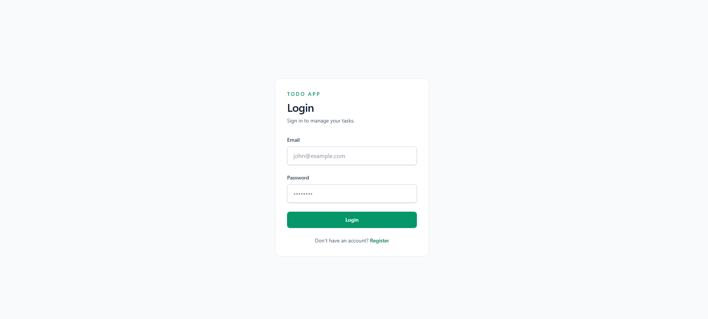
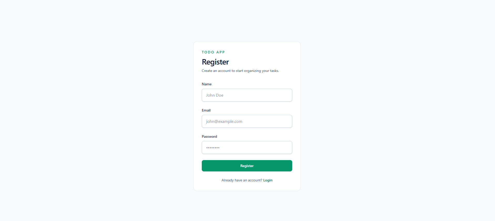
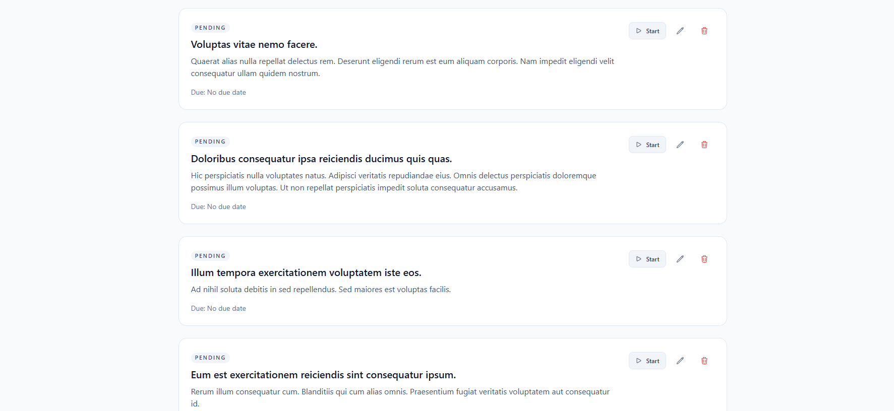
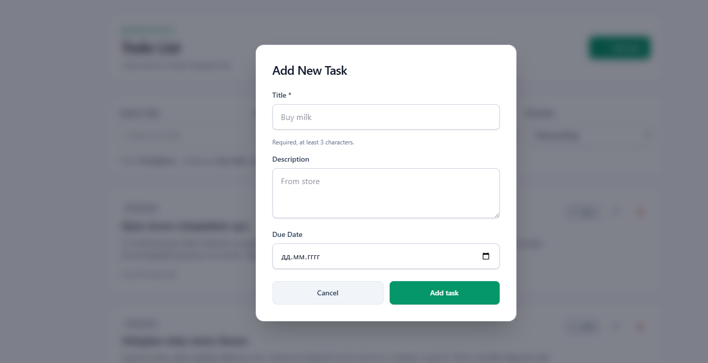
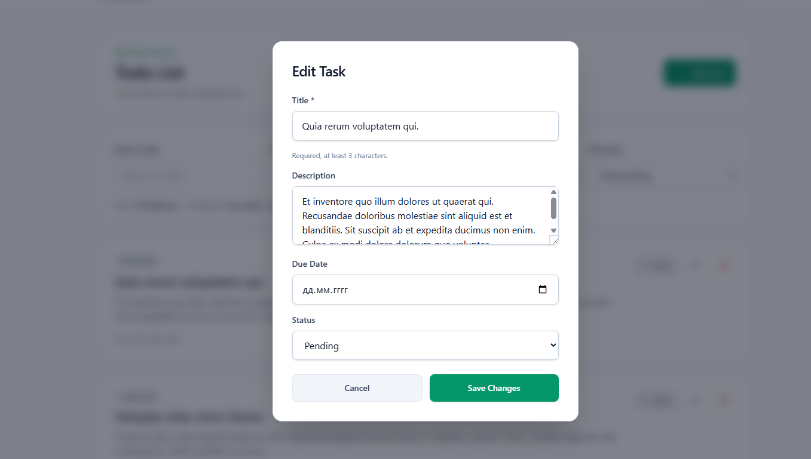

# Пользовательская документация Todo App

## О приложении

Todo App — это приложение для управления задачами. Здесь можно создавать задачи, редактировать их, менять статус, искать нужные записи и удалять лишние.

## Скриншоты

### Экран входа

### Экран регистрации

### Список задач

### Создание задачи

### Редактирование задачи

## Вход в систему

После первого запуска доступны тестовые пользователи.

- **Owner** — `owner@example.com` / `owner123`
- **Admin** — `admin@example.com` / `admin123`

## Роли и доступ

- **Owner** видит только свои задачи.
- **Admin** видит все задачи в системе, но не может создавать новые.

## Как работать с задачами

### Создать задачу

1. Нажмите **Add task**.
2. Заполните форму.
3. Нажмите **Add task** ещё раз.

Обязательное поле:

- **Title** — обязательно, минимум 3 символа.

### Изменить задачу

1. Нажмите иконку редактирования.
2. Внесите изменения.
3. Нажмите **Save Changes**.

### Изменить статус

Можно перевести задачу в один из статусов:

- **Pending** — не начата
- **In Progress** — в работе
- **Completed** — завершена

### Удалить задачу

1. Нажмите иконку удаления.
2. Подтвердите действие.

## Поиск и фильтрация

На странице доступны:

- поиск по названию задачи
- фильтр по статусу
- сортировка по дате или статусу
- выбор направления сортировки

## FAQ

### Почему я не могу создать задачу?

Проверьте, что вы вошли как **Owner**. Роль **Admin** может только просматривать задачи.

### Почему форма не отправляется?

Скорее всего, поле **Title** пустое или в нём меньше 3 символов.

### Как найти нужную задачу?

Используйте строку поиска вверху списка или отфильтруйте задачи по статусу.

### Можно ли удалить задачу?

Да. Для этого нажмите иконку удаления и подтвердите действие.
